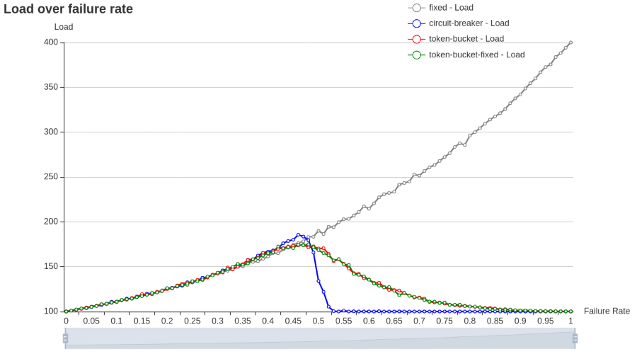
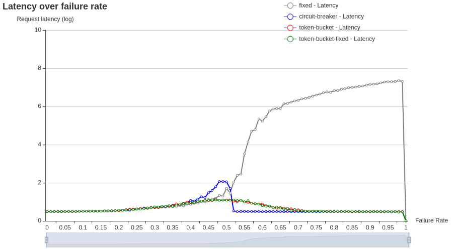

# Simulators
The simulator repository contains resources to build simple simulations with golang. The 
idea for this repository was inspired by the [mbrooker/simulator_example](https://github.com/mbrooker/simulator_example)

The repo consist of:  
- simulation folder - contains a lightweight framework[1] called sim to build event based 
  simulation on top of an event loop. The folder also contains a simple example on how to 
  use sim.
- eventloop folder - a somewhat more complex simulation that demonstrates the impact of 
  different retry strategies on the server load. The simulation is event based and uses 
  the lightweight framework mentioned above. The example uses the [go-echarts](https://github.com/go-echarts/go-echarts) to draw 
  charts for the statistics gathered in the simulation, output stored in the `build/graphs`
  folder. 
- iterative folder - an iterative approach to the simulation. Just a different way to 
  implement a simulation.   
  
[1] calling it a framework is too much; it's a small collection of utils to build an event
    loop for a simulation
    
### Charts generated by the simulation

   

    

